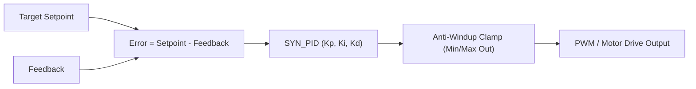

# Control & Motor Modules

SyntropicOS provides integer-only control algorithms, closed-loop PID controllers, trapezoidal motion profiling, and Field-Oriented Control (FOC) for BLDC/PMSM motors.

---

## Technical Specifications

| Feature | Specification |
|---|---|
| **Math Format** | Fixed-point Q16.16 (`q16_t`) or normalized integer scaling. |
| **FPU Requirement** | **None**. Runs on ARM Cortex-M0/M3/M4, RISC-V, and 8-bit MCUs. |
| **Safety Features** | Anti-windup clamping, derivative filtering, stall detection, & limit events. |

---

## 1. Closed-Loop PID Controller (`control/syn_pid.h`)

The `syn_pid` module provides an integer-only PID controller with anti-windup clamping and derivative-term filtering.

### Control Loop Diagram



### Complete Code Example (Integer PID Temperature / Speed Control)

```c
#include <syntropic/control/syn_pid.h>

static SYN_PID pid;

void control_init(void) {
    // Configure PID gains: Kp = 2.5, Ki = 0.5, Kd = 0.1, Output Range: 0 to 100% PWM
    SYN_PID_Config cfg = {
        .Kp = Q16_FROM_FLOAT(2.5f),
        .Ki = Q16_FROM_FLOAT(0.5f),
        .Kd = Q16_FROM_FLOAT(0.1f),
        .out_min = 0,
        .out_max = 1000, // 0 to 100.0% PWM
        .integral_min = -500,
        .integral_max = 500
    };
    syn_pid_init(&pid, &cfg);
}

uint16_t control_step(int32_t setpoint, int32_t current_reading) {
    // Compute control output step
    int32_t output = syn_pid_update(&pid, setpoint, current_reading);
    return (uint16_t)output;
}
```

---

## 2. Stepper Motor Control (`motor/syn_stepper.h`)

Provides Step/Direction motor driving with trapezoidal velocity acceleration profiles.

```c
#include <syntropic/motor/syn_stepper.h>

static SYN_Stepper stepper;

void stepper_init(void) {
    // Initialize pin 4 (step), pin 5 (dir), max_speed = 1000 steps/s, accel = 500 steps/s²
    syn_stepper_init(&stepper, 4, 5, 1000, 500);
}

void move_relative(int32_t steps) {
    syn_stepper_move(&stepper, steps);
}

void main_timer_isr(void) {
    // Serves step generation (call at fixed interrupt interval e.g. 10 kHz)
    syn_stepper_update(&stepper);
}
```

---

## 3. Field-Oriented Control (FOC) (`motor/syn_foc.h`)

Provides Clarke/Park transforms, Space Vector PWM (SVPWM), and Sliding Mode Observers (SMO) for sensorless BLDC/PMSM motor control in pure Q16.16 fixed-point math.

```c
#include <syntropic/motor/syn_foc.h>
#include <syntropic/motor/syn_foc_observer.h>

static SYN_FOCObserver observer;

void foc_setup(void) {
    SYN_FOCObserverConfig cfg = {
        .R = Q16_FROM_FLOAT(0.5f),    // 0.5 Ohm phase resistance
        .L = Q16_FROM_FLOAT(0.001f),  // 1 mH phase inductance
        .G = Q16_FROM_INT(10),        // Sliding mode observer gain
        .dt = Q16_FROM_FLOAT(0.0001f),// 10 kHz sampling period (100 µs)
        .Kp_pll = Q16_FROM_INT(150),
        .Ki_pll = Q16_FROM_INT(6000)
    };
    syn_foc_observer_init(&observer, &cfg);
}

void foc_10khz_isr(q16_t v_alpha, q16_t v_beta, q16_t i_alpha, q16_t i_beta) {
    // 1. Update Sliding Mode Observer with phase voltages and currents
    syn_foc_observer_update(&observer, v_alpha, v_beta, i_alpha, i_beta);

    // 2. Read estimated rotor angle theta_e [0, 2pi) and speed omega_e
    q16_t est_angle = syn_foc_observer_get_angle(&observer);
    q16_t est_speed = syn_foc_observer_get_speed(&observer);
}
```

---

## 4. G-Code & NIST RS-274 Motion Interpreter (`motor/syn_gcode.h`)

Zero-heap streaming ASCII G-code parser and multi-axis trajectory coordinator:
- **Parser**: Streaming word extraction (`G`, `M`, `X`, `Y`, `Z`, `I`, `J`, `K`, `F`, `S`, `P`, `T`).
- **Modal Engine**: G0/G1/G2/G3/G4, G17/G18/G19 planes, G20/G21 units, G90/G91 distance modes, G92 offsets, M3/M4/M5 spindle control, M7/M8/M9 coolant.
- **Interpolator Integration**: Automatic trajectory planning via `SYN_Interpolator` with S-curve/trapezoidal velocity profiles.

```c
#include <syntropic/motor/syn_gcode.h>
#include <syntropic/motor/syn_interpolator.h>

static SYN_Interpolator g_interp;
static SYN_GCode_Controller g_gcode_ctrl;

void gcode_setup(void) {
    SYN_GCode_Config cfg = {
        .interpolator = &g_interp,
        .default_feedrate = 200.0f,
        .max_acceleration = 1000.0f,
        .max_jerk = 5000.0f,
        .step_resolution = 0.001f,
    };
    syn_gcode_init(&g_gcode_ctrl, &cfg);

    /* Stream G-code blocks */
    syn_gcode_execute_line(&g_gcode_ctrl, "G21 G90 G0 X0 Y0 Z5");
    syn_gcode_execute_line(&g_gcode_ctrl, "G1 Z-1 F100");
    syn_gcode_execute_line(&g_gcode_ctrl, "G2 X10 Y10 I5 J0 F300");
}
```

---

## 5. Multi-Axis Robot Kinematics (`motor/syn_kinematics.h`)

Zero-heap integer Q16.16 multi-axis robot kinematics engine:
- **Transforms & Conventions**: Standard and Modified Denavit-Hartenberg (DH) 4x4 matrix transforms.
- **Forward Kinematics**: Arbitrary N-DOF serial manipulator forward kinematics with 3D position and roll/pitch/yaw Euler orientations.
- **Differential Kinematics**: Exact 6xN Geometric Jacobian computation for velocity mapping and singularity analysis.
- **Standard Robot Models**:
  - 3-DOF Planar Articulated Arm (FK & analytical IK with Elbow-Up / Elbow-Down selection).
  - 4-DOF SCARA Robot (FK & analytical IK with tool pitch/yaw).
  - 6-DOF PUMA Manipulator with Spherical Wrist (FK & Pieper analytical decoupling IK).
  - 3-Axis Delta Parallel Robot (FK via 3-sphere intersection & analytical IK).

```c
#include <syntropic/motor/syn_kinematics.h>

void scara_pick_and_place_demo(void) {
    SYN_Kinematics_SCARAConfig cfg = {
        .l1 = Q16_FROM_INT(200),     /* 200 mm inner arm */
        .l2 = Q16_FROM_INT(150),     /* 150 mm outer arm */
        .d_max = Q16_FROM_INT(100),  /* 100 mm Z stroke */
        .z_home = Q16_FROM_INT(100), /* 100 mm home height */
    };

    /* Define target 6D pose */
    SYN_Pose6D target = {
        .position = {.x = Q16_FROM_INT(250), .y = Q16_FROM_INT(100), .z = Q16_FROM_INT(20)},
        .orientation = {.roll = 0, .pitch = 0, .yaw = Q16_PI_4}
    };

    q16_t q1 = 0, q2 = 0, d3 = 0, q4 = 0;
    if (syn_kinematics_scara_ik(&cfg, &target, SYN_ARM_ELBOW_UP, &q1, &q2, &d3, &q4) == SYN_OK) {
        /* Drive joint actuators to solved angles */
    }
}
```

